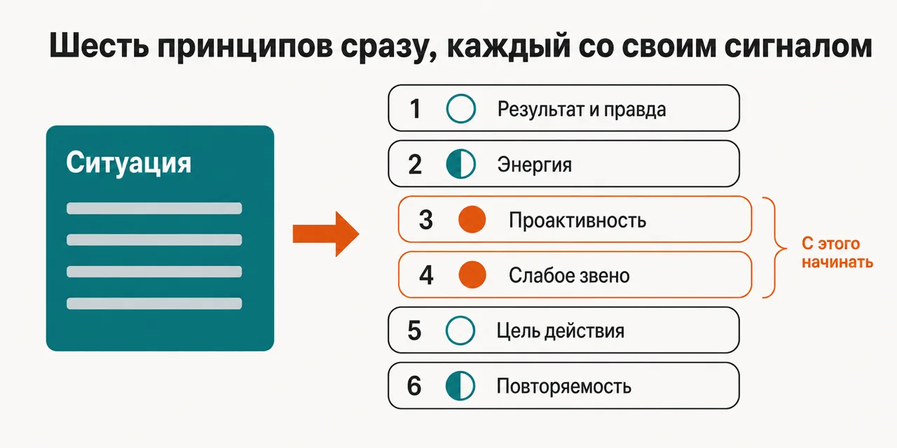
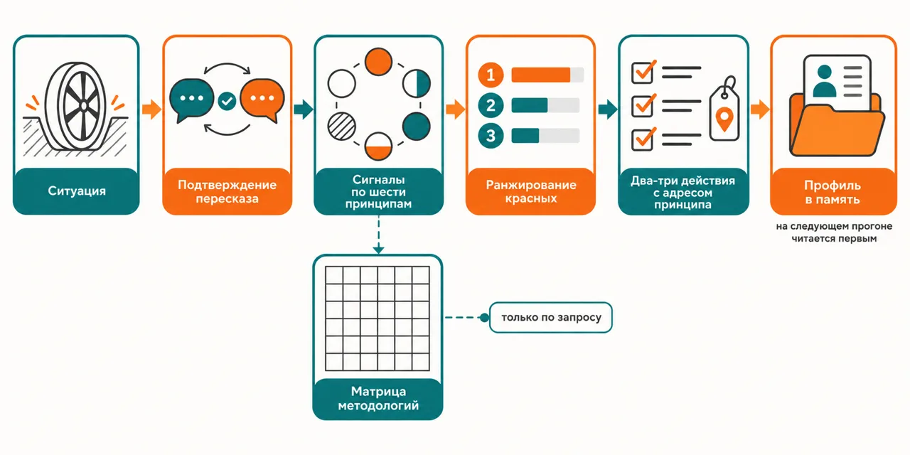

Русский · [English](README.en.md)

# Проект буксует — а спор идёт про то, какой фреймворк взять вместо нынешнего

Шесть принципов, которые лежат под PRINCE2, PMBOK, P3.express, DSDM, Scrum и XP, проверяются все
сразу, каждый получает зелёный, жёлтый или красный сигнал, и проверка идёт в том числе по той
методологии, на которой ты работаешь прямо сейчас.

```
claude plugin marketplace add https://github.com/beCyborg/jadlis-start.git
claude plugin install nupp@jadlis
```

Ключей не нужно ни одного и в интернет плагин не ходит: при установке спрашивают только папку на
твоём диске под память советов, а не задашь — совет всё равно работает, просто скажет об этом
первой строкой и не запомнит разбор.



Текстом: слева ситуация проекта своими словами, справа шесть принципов, каждый со своим сигналом, и
красные вынесены вперёд как то, с чего начинать.

Это моё рабочее место, выложенное как есть, а не продукт: чем перестал пользоваться — убрал.

## Было → стало

| Руками | Чатом с ИИ | Этим плагином |
|---|---|---|
| **Чем объясняется пробуксовка.** Объяснение растёт из той методологии, которую в команде знают лучше всего, и другие причины не рассматриваются. | Отвечает внутри той рамки, которая названа в вопросе: спросил про Scrum — получил ответ про Scrum. | Все шесть принципов применяются одновременно, а не по очереди: каждый получает зелёный, жёлтый или красный, и таблица показывает, какое звено слабое. |
| **Что делать со списком найденного.** Мест, где всё не по книжке, набирается десяток, и приоритет между ними ставить нечем. | Возвращает список рекомендаций длиной с методичку — выполняется из него ничего. | Красные ранжируются по влиянию на исход, и в ответ уходит не больше двух-трёх пунктов: то же правило 80/20, что совет проверяет у тебя, применяется к его собственному выводу. |
| **Насколько совет привязан к этому проекту.** Совет из книги написан для проекта вообще, подгонять его под свой случай приходится самому. | «Будьте проактивнее» звучит как ответ и проходит незамеченным. | Каждая рекомендация обязана назвать альтернативы, принцип с адресом файла и привязку к типу проекта, методологии, роли и стадии — иначе это трюизм, и это видно в самом вердикте. |
| **Как выбирается методология.** Спор Agile против Waterfall идёт про лагеря и сертификаты, а не про исход проекта. | Называет то, что чаще встречалось в текстах, без привязки к твоему контексту. | Строится матрица покрытия: шесть принципов на шесть методологий, каждая клетка — Strong, Moderate или Weak под твой проект, плюс план подгонки под то, что методология не закрывает. |
| **Что остаётся после разбора.** Через квартал не помнишь, какое звено было слабым и что с ним сделали. | История переписки к следующему разговору не подтягивается. | Профиль проекта с сигналами по шести принципам ложится в папку памяти, а на следующем прогоне читается первым — и совет спрашивает, что из него ещё верно. |

## Как это работает



На входе — тип проекта, методология, твоя роль, стадия и то, что именно пошло не так.
Внутри — ситуация пересказывается тебе на подтверждение, потом шесть принципов работают как шесть
диагностических линз сразу и каждый получает свой цвет.
На выходе — красные по порядку влияния, два-три конкретных действия и профиль проекта в папке
памяти.

Текстом: ситуация → подтверждение пересказа → сигналы по шести принципам → ранжирование красных →
два-три действия с адресом принципа → профиль в память.

Проверяются шесть вещей, и названия у них такие: принадлежность к лагерю против результата и правды;
энергия и ресурсы; проактивность; слабое звено; цель каждого действия; повторяемые элементы. Под
каждым лежит отдельный файл с диагностическими вопросами, разбором методологий и списком
антипаттернов, и читается он тогда, когда сигнал загорелся, а не весь сразу.

Требует протокол рассуждения от каждой рекомендации четыре вещи: названные альтернативы и почему
выбрана эта, ссылку на принцип с адресом файла, привязку к твоему проекту вместо абстракции и
прямое имя антипаттерна, если ситуация на него легла. Антипаттерны названы заранее и в файлах
разобраны: методологический трайбализм, сбор практик из разных методологий вместо подгонки одной,
«процессы — это зло», деятельность без цели, управление по факту пожара, всё заново каждый раз.

Проверяет сомнительное действие тестом параллельных миров, а не мнением: два мира, одинаковые во
всём, кроме этой встречи, этого отчёта, этого процесса, — насколько они различаются. Разницу
получилось сформулировать — это и есть цель, и по ней видно, какой должна быть форма. Не
получилось — действие переделывают или убирают.

Строится матрица методологий не всегда, а только когда вопрос про выбор или оценку методологии.
Лучшей вообще нет: покрытие считается под конкретный проект, и вместе с рекомендацией идёт план
подгонки под пробелы. Менять методологию совет не требует — эти принципы лежат под ней, а не вместо
неё, и рекомендация формулируется в терминах того, чем ты уже пользуешься; когда она этому
противоречит, размен называется вслух.

## Установка и первый запуск

**а) Текст для вставки агенту.** Скопируй целиком в чат Claude Code:

```
Ты — установщик. Поставь на этот Mac плагин nupp из маркетплейса jadlis.
Выполни ровно эти команды, дословно, ничего не сокращая:
1. claude plugin marketplace add https://github.com/beCyborg/jadlis-start.git
2. claude plugin install nupp@jadlis
3. claude plugin list — покажи мне строку про nupp и его версию.
Ключей этому плагину не нужно ни одного, интернет ему тоже не нужен. Он спросит одно —
папку памяти, куда пишется профиль проекта: путь называю я, ты его не придумываешь.
Перед каждой командой покажи её мне целиком и дождись «да». Сказал «нет» — не выполняй,
скажи, что именно пропустил, и иди дальше.
Команда вернула ошибку — остановись, покажи вывод, к следующей не переходи.
```

**б) Команды руками.**

```
claude plugin marketplace add https://github.com/beCyborg/jadlis-start.git
claude plugin install nupp@jadlis
claude plugin list
```

Первая команда ничего не ставит — она добавляет маркетплейс. Ставит только вторая, и снимается
она одной строкой: `claude plugin uninstall nupp@jadlis --keep-data`.

Папку памяти можно задать прямо в установке — `claude plugin install nupp@jadlis --config
MEMORY_DIR=~/advisors-memory`. Ключ настройки называется `MEMORY_DIR`, он необязательный, значение
по умолчанию `~/advisors-memory`, и одну и ту же папку могут делить все советы Jadlis: профиль
этого совета лежит в ней по пути `Профили/adv-nupp.md`. Папку плагин разворачивает сам при первом
запуске и существующие файлы не трогает. Поменять её потом можно переустановкой с `--config`: на
уже установленном плагине этот флаг молча ничего не меняет (проверено 07.09.2026). Ключ остался
пустым — совет об этом скажет и продолжит без памяти.

**в) Короткая команда.** Открой Claude Code в папке, где работаешь, и набери:

```
/nupp <что происходит с проектом>
```

Не находится — сверь имя строкой `claude plugin list`. Совет сначала спросит тип и размер проекта,
методологию, твою роль, стадию и то, что стало поводом для разговора, — а если всё это уже есть в
твоём описании, спросит только недостающее. Дальше он перескажет ситуацию своими словами и не
пойдёт дальше, пока ты не подтвердишь, что понял верно.

## Границы, стоимость, обновление

**Чего не делает.** Не ведёт проект и не заменяет методологию: эти принципы лежат под ней, поэтому
переезда на новый фреймворк совет не предлагает. Не собирает данные о проекте сам — работает
ровно с тем, что ты рассказал, и на неполном рассказе диагноз будет неполным. Не ходит в интернет
и не смотрит на свежие данные. Не проверяет свои выводы перекрёстно и не ведёт леджер утверждений:
здесь нет ни линз, отвечающих порознь, ни скептиков — это один разбор одним скиллом. Не пишет
вердикт отдельным файлом: в память ложится только профиль проекта с сигналами и заметками сессии.
Не выдаёт шесть находок разом — говорит про те один-два принципа, что реально мешают. И не
заменяет юриста, бухгалтера, финансового советника и врача: границы описаны в `NOTICE.md`.

**Что нужно.** Ключей не нужно ни одного, внешних MCP-серверов и сторонних CLI — тоже. Нужна
папка на диске под память советов, если хочешь, чтобы разбор сохранялся, и Claude Code с доступом
к Opus: скилл закреплён на этой модели. Файлы принципов внутри плагина написаны по-английски —
разговор идёт на твоём языке, но цитируемые названия принципов и антипаттернов приходят в
английской формулировке.

[уточнить] — минимальная версия Claude Code в репозитории не зафиксирована.

[уточнить] — первоисточник мета-системы NUPP в файлах плагина по имени не назван.

**Порядок расхода токенов.** Прогон лёгкий: это один скилл в твоей сессии, без воркфлоу и без
фан-аута субагентов — тяжёлые прогоны живут в советах, где линзы отвечают параллельно. Дороже
прочего обходится чтение файлов принципов, поэтому подробный файл открывается только тот, что
понадобился по загоревшемуся сигналу, а не все шесть сразу. Разговор длинный: интервью,
подтверждение пересказа и матрица методологий добавляются по мере надобности, и остановиться можно
после сигналов, не доходя до матрицы.

**Проверено там, где я работаю:** мой Mac, моя подписка. Где ещё это работает — [уточнить].

**Условия использования.** Лицензии нет: все права сохранены за автором. Читать и
пользоваться лично можно. Коммерческое использование, переиздание и включение в свои
продукты — по договорённости со мной.

**Обновление.** У стороннего маркетплейса авто-обновление на твоей стороне выключено: пока не
запустишь первую команду, у тебя остаётся та версия, которую ты поставил. Сам репозиторий
собирается генератором из закрытого источника, поэтому правка приезжает сюда следующим релизом, а
не коммитом в этот репозиторий.

```
claude plugin marketplace update jadlis
claude plugin update nupp@jadlis
claude plugin list
```

Переустановка, если что-то встало криво:

```
claude plugin uninstall nupp@jadlis --keep-data && claude plugin install nupp@jadlis
```
